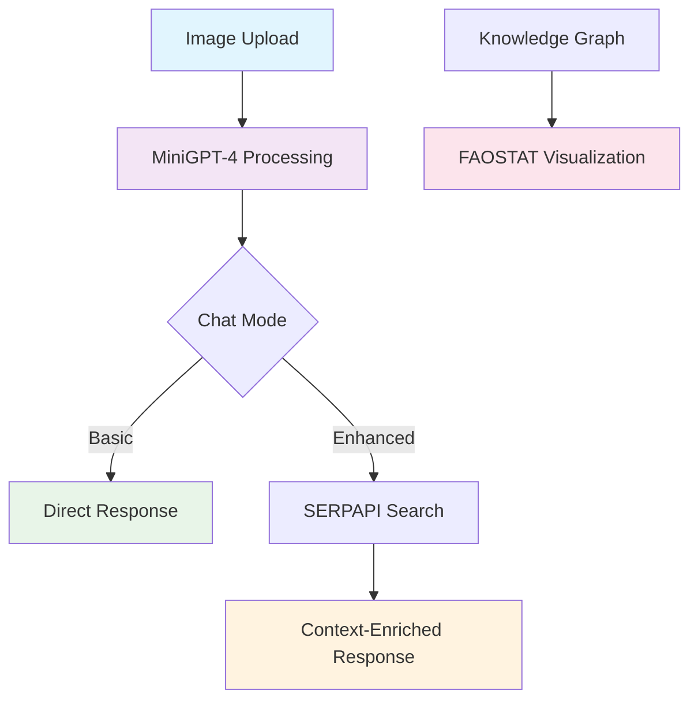

# MiniGPT-4 Enhanced: Visual Q&A with Knowledge Graph Integration

> **⚠️ Work in Progress** - This project is actively being developed. Some features might be wonky.

## What's This About?

This is an enhanced version of MiniGPT-4 that adds some pretty cool features on top of the base model:

- **Dual Chat Interface**: Basic mode for quick queries, Enhanced mode with web search integration
- **Knowledge Graph Visualization**: Interactive FAOSTAT-based knowledge graphs (because who doesn't love seeing data connections?)
- **SERPAPI Integration**: Get real-time web context to make responses more current and accurate
- **Gradio Web Interface**: Clean, user-friendly interface for interacting with the model

Built on top of the original MiniGPT-4 architecture but with our own special sauce 🌶️

## 📋 Quick Start

### Prerequisites

You'll need:
- Python 3.8+ (3.9 recommended)
- CUDA-capable GPU (for decent performance)
- ~8GB+ GPU memory (depending on model size)
- SERPAPI account (for enhanced search - optional but recommended)

### Installation

1. **Clone and Setup**
```bash
git clone <your-repo-url>
cd MiniGPT-4
pip install -r requirements.txt
```

2. **Environment Variables**
Create a `.env` file in the root directory:
```env
SERP_API_KEY=your_serpapi_key_here
```
*Note: Without SERPAPI key, enhanced search won't work but basic functionality will*

3. **Download Model Weights**
```bash
# You'll need to get the MiniGPT-4 checkpoint
# Check the original repo for download links
# Place in: minigptfour/checkpoints/
```

### Running the Demo

```bash
cd minigptfour
python demo_v3.py --cfg-path eval_configs/minigptv2_eval.yaml --gpu-id 0
```

## 🎯 Features

### Core Capabilities



### 1. **Visual Question Answering**
- Upload images and ask questions about them
- Supports various image formats (PNG, JPG, etc.)
- Sketch functionality for highlighting areas of interest

### 2. **Dual Chat Modes**

#### Basic Mode 🚀
- Direct interaction with MiniGPT-4
- Fast responses
- Good for straightforward image analysis

#### Enhanced Mode 🔍
- Includes web search context via SERPAPI
- More comprehensive answers
- Better for complex or current event questions
- *Warning: Responses take longer due to web search*

### 3. **Knowledge Graph Integration**
- Interactive visualization of FAOSTAT data
- Shows relationships between agricultural/food statistics
- Helps understand data connections visually
- *TODO: Make this more dynamic and user-configurable*

## 🏗️ Architecture Overview

```
minigptfour/
├── minigpt4/                   # Core model implementation
│   ├── models/                 # Model architectures
│   ├── datasets/               # Dataset loaders
│   ├── processors/             # Image/text processing
│   └── conversation/           # Chat handling
├── configs/                    # Configuration files
├── eval_configs/               # Evaluation configurations
├── demo_v3.py                  # Main demo interface
└── requirements.txt            # Dependencies
```

### Key Components

1. **MiniGPT-4 Base**: The foundation visual language model
2. **Gradio Interface**: Web-based user interface
3. **SERPAPI Integration**: Real-time web search
4. **Knowledge Graph**: FAOSTAT data visualization
5. **Conversation Management**: Chat state handling

## 🔧 Configuration

### Model Configuration
Edit `eval_configs/minigptv2_eval.yaml` to adjust:
- Model checkpoint path
- Processing parameters
- Memory settings

### Demo Configuration
In `demo_v3.py`, you can tweak:
- Temperature settings (0.1-1.5)
- Max tokens (currently 500)
- GPU device selection

## 📊 Known Issues & TODOs

### Current Issues 🐛
- [ ] Knowledge graph CSV files need to be present (kg_nodes_faostat.csv, kg_relationships_faostat.csv)
- [ ] SERPAPI rate limiting not handled gracefully
- [ ] Large images might cause memory issues
- [ ] Gradio compatibility issues with some versions

### Feature Wishlist 🌟
- [ ] Support for multiple image uploads
- [ ] Custom knowledge graph data sources
- [ ] Better error handling and user feedback
- [ ] Chat history persistence
- [ ] API endpoint for programmatic access
- [ ] Multi-language support (maybe?)

## 🎮 Usage Examples

### Basic Image Analysis
1. Upload an image
2. Ask: "What do you see in this image?"
3. Get detailed description

### Enhanced Context Search
1. Upload an image of a landmark
2. Switch to Enhanced mode
3. Ask: "What's the history of this place?"
4. Get response enriched with current web information

### Knowledge Graph Exploration
1. Check out the interactive graph on the interface
2. Explore connections between agricultural concepts
3. *Note: This is mostly for visualization right now*

## 🤝 Contributing

Want to help make this better? Here's how:

1. Fork the repo
2. Create a feature branch (`git checkout -b feature/amazing-feature`)
3. Make your changes
4. Test thoroughly (please!)
5. Submit a pull request

### Development Notes
- Code style: We're not super strict, but try to be consistent
- Testing: Add tests for new features when possible
- Documentation: Update this README if you add major features

## 📚 References & Credits

- Original MiniGPT-4: [Link to original repo]
- SERPAPI: [serpapi.com](https://serpapi.com)
- FAOSTAT: [fao.org](https://fao.org)
- Gradio: [gradio.app](https://gradio.app)

## 🛠️ Troubleshooting

### Common Issues

**"SERP_API_KEY not found"**
- Create a .env file with your SERPAPI key
- Or run in basic mode only

**"CUDA out of memory"**
- Reduce batch size
- Use smaller images
- Switch to CPU (not recommended)

**"Module not found"**
- Check if you're in the right directory
- Verify all dependencies are installed
- Try: `pip install -r requirements.txt` again

**Knowledge Graph not showing**
- Make sure CSV files are present
- Check file paths in demo_v3.py
- Refresh the page

## 📝 License

This project builds upon MiniGPT-4 and follows similar licensing terms. Check the original repo for details.

---

> **Note**: This is a research project and not intended for production use without proper testing and validation. Use at your own risk! 